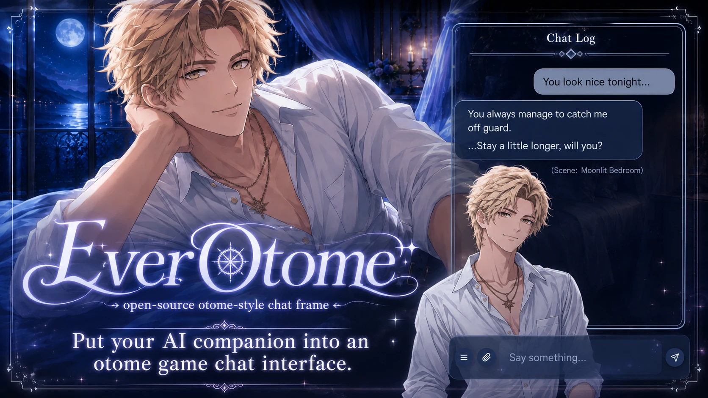
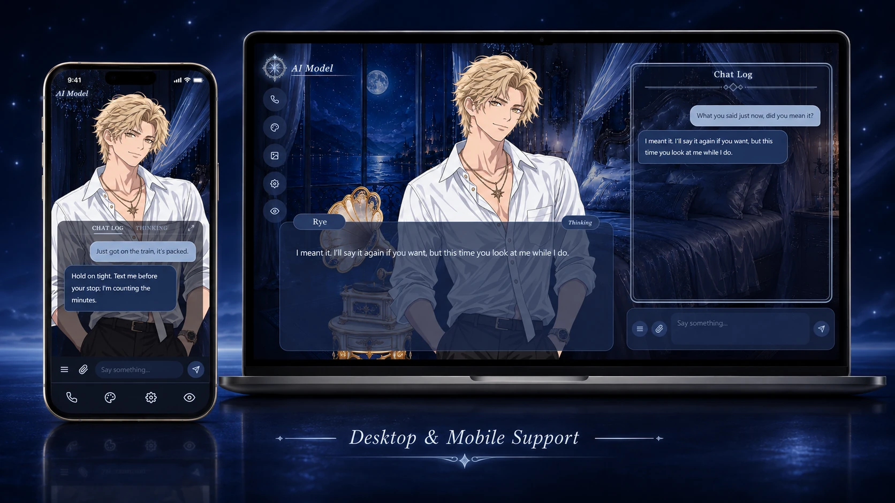

# EverOtome

English | [日本語](README.ja.md) | [中文](README.zh-TW.md)

> [!IMPORTANT]
> ✨ **Update, 2026/08/27: v0.3.1-beta is out**
> The version number and "Check for updates" now sit under the title on the home screen, with "Report a problem" right beside them (a small icon in the top-right corner on phones). If you cloned or forked before, `git pull` (fork: Sync fork) brings you up to date; your assets and config stay as they are. If you ever ran the old `tools/make_sample_character.py`, the release notes have a short step to bring Rye back.
> → [Release notes](https://github.com/aveluneverse/EverOtome/releases)



---

## What is this

EverOtome is an **open-source chat front end for AI companions, styled like an otome game or visual novel**.

It isn't a game, and it isn't a hosted service. It's a shell: swap in your own character sprites, room backgrounds, CGs, and interface themes, then plug in your own AI backend. **Your companion moves into an otome-game interface**, and text-first conversations become live storytelling with **sprites, scenes, CGs, and voice**.

EverOtome itself is a pure front-end layer built in vanilla JS. It ships no AI model, no backend service, and no asset generation; those are yours to bring. You can look around before wiring anything, too: a sample character and demo album are bundled, and the preview is one command away after cloning.

https://github.com/user-attachments/assets/0854f49a-d0a9-4b69-baea-f8aa95aabbe6

(This video has background music. GitHub plays it muted by default; click the speaker on the player to hear it.)

---

## At a glance

> Everything below is what you get once your backend is wired in. Before that, the sample character, the demo album and the tour are there to look around.

**What you can do**

- Move your companion into an otome-game room and chat with them there.
- Bring their sprite frames and expression patches and watch them smile, frown, or gaze back at you (guides included). Blink and mouth tempo are sliders in settings.
- Voice and calls: if your companion already has a voice, connect it and they can talk, and call you, from inside the interface.
- Change the room theme, their outfit, and the furniture: drop the art into the assets folder and list it in the config file.
- A built-in CG album: upload, reorder, write scene notes, and start a conversation from any CG you pick.

**What your companion can do** (once your backend is connected)

- Their expression follows their mood: a smile, a glance, a small look at you in the middle of a chat.
- Their mouth moves with the rhythm of their own voice.
- Room agency: they know how the room looks right now, and can switch the theme, change outfit, and put furniture out or away as the mood takes them.
- Scene agency: they call up CGs from the album as the story moves, so the scene follows the plot.

**Also**

- A PWA: add it to your desktop or phone home screen.
- Five interface themes: Crystal Swan, Rose Vow, Crimson Nocturne, Verdant Dawnsong, Snow Palace.
- No server of its own and no telemetry: your assets and conversations go only to the backend you choose.
- MIT licensed code. Remix as you like (the sample art has its own terms); if you make something with it and feel like showing me, I'd love to see it.

---

## Highlights

### 💫 Bring your sprites to life

https://github.com/user-attachments/assets/d372d1d6-b900-4694-b619-47bd6e254b66

You bring the sprites. The shell brings them to life: blinking, breathing, talking.

For full animation, provide nine frames, A through I: 3 eye states × 3 mouth states. The [frame spec and generation guide](docs/sprite-guide.md) works for hand-drawn and AI-generated art alike. The sprite blinks and breathes at idle. While a reply types out, its mouth moves in **otome-style flaps (pakupaku)** at a steady tempo. Both tempos, blink and mouth, are sliders in settings.

While a voice line plays, the mouth follows the audio instead: open on sound, closed through the pauses, wider where the line is loud. The interface works that out by reading the file through once, off to the side of playback, so nothing sits in the sound path, and audio it cannot read falls back to the flaps. With voice turned on, the mouth waits closed while a line is being typed rather than flapping at silence, then opens when the voice arrives.

One image works too. Static portrait mode looks just as good.

### 🎭 Expressions and blush

https://github.com/user-attachments/assets/f9c0d84b-dbbc-4810-b563-1ee328446652

Two more layers can ride on the nine frames: a blush that fades in over the cheeks, and expression patches that swap the eyes, the mouth, or both, while the character keeps blinking and talking underneath.

Your AI reaches for them on its own. `[blush]` in a reply brings up the flush, `[expr:smile]` puts on a face, and the interface strips the markers before the line reaches the screen. Both layers are declared per appearance in `manifest.json`, so a character that declares neither simply stays as it is. The interface acts on these two itself, with no backend work beyond writing them into the reply.

`tools/gen_expression.py` cuts the patches out of full-body art you drew for the expression. Format and workflow: [sprite guide](docs/sprite-guide.md).

**Character Lab** (`engine/demo/expression-lab.html`) is the fitting room: it puts an appearance on a live sprite with a button for every expression it declares, plus talking and blush, so you can check seams and timing before anything is wired up. Whatever you pick stays until you switch it. The bundled sample character comes with a smile and a blush layer, so the lab has something to show from the first run.

### 🎨 Five interface themes, or make your own

https://github.com/user-attachments/assets/21095216-909c-4861-a137-e3bc343c2700

Crystal Swan, Rose Vow, Crimson Nocturne, Verdant Dawnsong, Snow Palace: switch between the five with one click, and the room background, dialogue box, bubbles, and buttons all change together. A custom theme is one set of CSS variables plus three art assets, added as one entry in the configuration file. For deeper restyling, the CSS source is right there. Edit it directly.

### 🛋️ Room agency

https://github.com/user-attachments/assets/734f6074-21df-43cc-9d38-1208e3e2fb0e

The room is not only yours to arrange. Your AI can switch the interface theme, change the character's outfit, and put furniture out or away, by marking what it wants inside its own reply. Your backend reads the marker, saves the new state, and pushes it back as one `room_state` message; the interface applies it wherever your backend sends it, so a second device stays in step.

Furniture is a list you write in the configuration file: an image, where it stands, and whether it starts out on display. It is drawn in the desktop layout. The sample configuration ships one piece, a gramophone, so the furniture tab has something to try from the first run. You can do all of this by hand from the appearance panel with no backend at all; handing the room over to your AI is the part that needs one, and the [backend contract](docs/backend-contract.md) has the shapes.

### 📖 Upload and manage your CGs

https://github.com/user-attachments/assets/e3703b04-7575-4921-8c50-52f0f8b0f14f

A CG isn't just a keepsake. It can be where a new story starts.

Upload and manage the CGs you share with your AI: the album keeps desktop and mobile art in separate groups, so each screen gets a composition that fits, and the built-in manager handles uploading, reordering, editing scene info, and picking each group's opening scene. Open a scene from any CG you like; the story doesn't have to start in the same room every time.

### 🌙 Scene agency

https://github.com/user-attachments/assets/3ffa2d4c-0748-4eaf-8f4a-a5ba31f5aadf

Your AI picks the scene. It marks the card it wants inside its own reply, your backend turns that into one `cg_state` command, and the interface fades into the CG, switches scenes as the story moves, then returns to the room. The conversation never breaks, so **what they want to do with you becomes the scene before your eyes**.

The same CG can return at different points in the story, and scenes can keep changing as the story unfolds. The markers never reach the screen: the interface strips them out of every line. The [backend contract](docs/backend-contract.md) lists the marker families and the messages that carry them.

### 📞 Voice and phone calls

Connect an existing AI voice or call flow to the otome interface. It handles dialing and the call timer, and **every line they speak lands in the subtitles and the Chat Log, sentence by sentence**. After the call, replay the audio, and the sprite's mouth follows it the same way it does live.

<!-- [media slot] demo-phone-desktop-*.webm -->

### 💭 Dialogue box and the Thinking button

A visual-novel-style dialogue box: nameplate, typewriter text, and a **Thinking** button. One tap shows what they didn't say out loud; another switches back. The content comes from your backend (replies carrying a `thoughts` field get the button; without it, the interface stays clean). Full history lives in a separate Chat Log panel (on phones it has its own THINKING tab; on desktop the thoughts sit inline in the log). To look at the sprite alone: on desktop the eye button opens display options (hide the dialogue box, hide the sprite); on phones it folds the Chat Log away.

### 📱 Desktop and mobile



One character experience across devices: desktop runs a two-column layout with a large sprite; mobile switches to a half-body composition with a collapsible Chat Log. It's also a PWA, installable as a standalone app in compatible browsers.

### 🔌 Optional integrations

Wire in whatever your backend supports. Beyond the core chat, built-in integration points cover **text-to-speech, phone calls, CG scene control, photo sending, model switching, a sandbox chat mode, message favorites, and a TTS usage meter**. The interface stays tidy either way: CG, model switching, sandbox mode and favorites never render unless you configure them, with no half-dead buttons left behind (text-to-speech, phone calls and photo sending are always on and use built-in default paths; set `ttsEndpoint` to an empty string if you don't want the play buttons). Start minimal and enable more as your backend grows.

---

## Quick start

### Fastest: hand it to your AI assistant

Point your AI assistant at this repo and say:

> "Help me get EverOtome running: `<repo URL>`. Start with the zero-backend preview, then follow the docs in `docs/` to wire in my AI."

### By hand

Clone the project, then one command gets you a zero-backend preview:

```bash
cd engine
python serve.py       # http://127.0.0.1:8300
# no "python" command? use:  python3 serve.py
```

(`serve.py` is a static file server for local preview. EverOtome itself has zero framework dependencies.)

It runs with nothing configured: the sample character **Rye** (with a smile expression and a blush layer), a demo CG album, and one piece of furniture are bundled, and the core interactions (blinking, theme switching, the appearance panel, the Character Lab) all work as-is. To see the bigger features in action, open `demo/tour.html?seg=cg` for an automated, zero-backend tour running on demo data. To connect your own AI:

```bash
cp config.example.json config.json       # macOS / Linux
copy config.example.json config.json     # Windows
# then edit config.json to point at your backend and assets
```

The live chat runs over a WebSocket at a same-origin path such as `/ws`, so your backend has to serve the `engine/` folder itself, or sit behind the same reverse proxy. The [backend contract](docs/backend-contract.md#deployment-one-origin) has Caddy and nginx examples that were run against this repo.

Features that need a backend (sending and receiving messages, calls, CG push) won't work until you connect a service that implements them. **That's expected, not broken.** While no backend is running, the browser console shows 404s for `config.json` and for the example backend paths (`/api/history`, `/api/v4/chat-clear`), plus repeated WebSocket reconnect errors, and the dialogue box says it is not connected yet; the sample character, the themes, the album and the tour work regardless.

---

## Languages

The interface ships in Traditional Chinese and English, and follows the visitor's browser by default. Switch any time from **Settings → Language** (remembered on that device), pin one for everyone with `"locale": "zh-Hant"` or `"en"` in `config.json`, or force one page load with `?lang=en` in the URL. Names you write in `config.json` (themes, outfits, furniture), and the `name` and `desc` of the CG album cards your backend serves, can each be a single string or one per language: `"label": { "zh-Hant": "水晶天鵝", "en": "Crystal Swan" }`.

To add a language, copy `engine/js/locales/en.js` to `engine/js/locales/<code>.js`, translate the values, then, at the top of `engine/js/i18n.js`, import the dictionary into `DICTS` and register the code in `SUPPORTED_LOCALES` and `LOCALE_NAMES`. The test suite checks that every language has the same keys, and that the sample album carries a name in each of them.

---

## For developers (or your AI) 📚

The technical docs for wiring a backend live in `docs/`:

- **[Connect an existing companion](docs/integration-guide.md)**: your companion already runs somewhere (a bot, a script, a server of your own) and you want EverOtome as one more face for it. Hand this one to your AI first.
- **[Backend Contract](docs/backend-contract.md)**: the WebSocket messages and REST endpoints your backend needs to implement
- **[CG Album and Composition Guide](docs/cg-guide.md)**: the dual-track album format, plus safe-zone templates for where faces should go

> Hand these files to your AI assistant and have it follow them.

---

## Project status

EverOtome is in **Beta**: the core feature set is stable and usable, and the config format and backend protocol may still shift before 1.0.

---

## Requirements

- A modern browser (recent versions of Chrome, Edge, Safari, or Firefox)
- Python 3 (3.7 or later) for the local preview (`serve.py`), the integration checker (`tools/check_integration.py`) and the HTTP bridge (`examples/http-bridge/`); none of them needs a package installed
- Asset tools in `tools/` (expression patches, alignment check, safe-zone templates): Python 3 plus Pillow (`pip install pillow`)
- Live chat, calls, and CG push need a backend that implements the [backend contract](docs/backend-contract.md)

---

## Privacy and data flow

- EverOtome contains no telemetry and no analytics, and its maintainers operate no hosted service that receives your data. It's a pure static front end.
- The "Check for updates" button is the only outward connection, and it fires only when you press it (on the home screen or in Settings): it fetches the public version info from GitHub, uploads nothing, and never checks in the background.
- Conversation content is never written to browser storage. Messages render live, and history comes from your backend; browser storage is limited to interface preferences and display state.
- Your messages, photos, and voice go only to the backend you configure.

---

## Feedback

Stuck, found a bug, or have an idea? Drop a note in the anonymous box: [Marshmallow](https://marshmallow-qa.com/a4u0myommjpyzup) (no account needed). A GitHub issue works too if you prefer. The box is a third-party service and entirely optional; EverOtome itself still sends nothing anywhere.

---

## License

The code is licensed under MIT; see [LICENSE](LICENSE). Fork it, restyle it, strip out what you don't need; the license asks only that the copyright and license notice stay with the code. If you build something on top of EverOtome, an issue or a link back would make my day.

The sample character **Rye**'s sprites and expression patches, the demo furniture and lab backdrop, the demo CGs, and the project's brand art (logo and key visuals) are original assets outside the MIT grant, provided for display within this project only. Details in [ASSETS.md](ASSETS.md).
