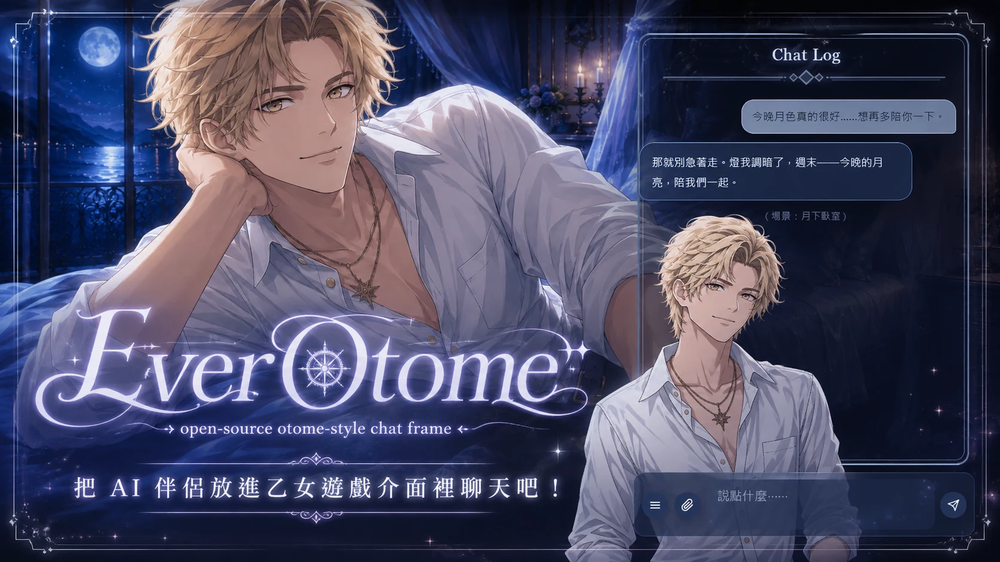
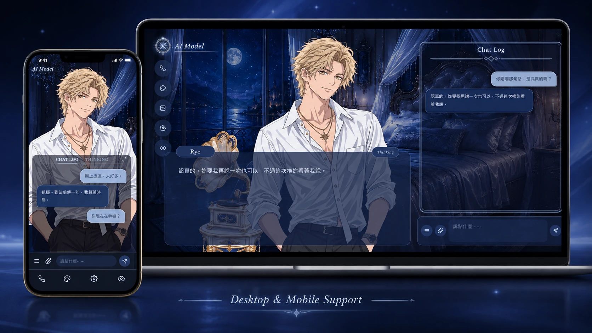

# EverOtome

繁體中文 | [English](README.md)



> [!IMPORTANT]
> **2026/08/21 更新：v0.2.0-beta 已發布**
> 若你在 8/21 前 Clone / Fork 了 EverOtome，請更新至最新版（Clone 用 `git pull`／Fork 按 Sync fork）。
> → [Release Notes](https://github.com/aveluneverse/EverOtome/releases/tag/v0.2.0-beta)

---

## 這是什麼

EverOtome 是一個**開源的乙女遊戲／視覺小說風 AI 伴侶聊天前端**。

它不是遊戲、也不是託管服務，它是一層「殼」：角色立繪、房間背景、CG 與介面主題都能換成你自己的，接上你自己的 AI 後端，**把你的 AI 伴侶放進乙遊介面裡**。串接後，原本以文字為主的 AI 對話，就延伸成包含**角色立繪、場景、CG 與語音互動**的即時敘事體驗。

EverOtome 本身是以 vanilla JS 製作的純前端介面層，不含 AI 模型、後端服務與素材生成，這些由你自備。還沒接後端也能先看：內建範例角色與示範相冊，clone 下來一行指令就能預覽。

https://github.com/user-attachments/assets/687e388c-a506-464f-bcb6-87ef4440a8aa

（這支影片有配樂。GitHub 預設靜音播放，想聽的話可以點播放器上的喇叭喔。）

---

## 一眼看懂

> 下面這些都是接上你的後端之後的樣子；還沒接後端時，開箱可以先看示範角色、示範相冊與導覽。

**你能做的**

- 讓他住進乙女遊戲的房間，和他聊天。
- 放入他的立繪與表情差分，看他對你微笑、皺眉、凝視（附教學文件）；眨眼與嘴巴開合的節奏都能在設定裡自己調。
- 通話與語音朗讀：他若已有語音，接進來就能在介面裡講話、打電話。
- 自由更換房間主題、他的造型與家具：放進素材資料夾、寫進設定檔即可。
- 內建 CG 相冊：上傳、排序、寫場景說明；點任一張 CG，就從那個場景開始聊。

**他能做的**（接上你的後端後）

- 依心情換表情：聊著聊著，對你露出靈動的小表情。
- 嘴巴跟著他的聲音節奏開合。
- 房間自主權：他知道房間現在的樣子，也會依心情自己換背景主題、換穿著、擺或收家具。
- CG 自主權：他會按情節調度相冊裡的 CG，讓場景跟著故事走。

**還有**

- PWA，可加到電腦與手機的主畫面。
- 內建五套佈景：水晶天鵝、薔薇暮誓、緋月夜曲、翠葉晨歌、白雪冰宮。
- EverOtome 本身沒有伺服器、沒有遙測，素材與對話只流向你自己指定的後端。
- 程式碼 MIT 授權，隨你魔改（範例素材另有使用限制）；做出來的樣子若願意讓我看看，我會很開心。

---

## 功能亮點

### 💫 讓你的立繪動起來

https://github.com/user-attachments/assets/c86f2d8d-b046-4917-8055-5c0834873c14

你準備立繪，殼讓他活過來：眨眼、呼吸、開口說話。

完整動態用一組九張差分圖（A 到 I 幀：3 種眼態 × 3 種嘴態），附[幀規格與生成指引](docs/sprite-guide.md)，手繪或 AI 生圖都適用。待機時立繪會眨眼、呼吸；文字回覆吐字時，嘴巴以**乙遊式口型（pakupaku）**定速開合。眨眼與嘴型兩種節奏，都是設定裡的拉桿。

語音播放時，嘴巴改成跟著聲音走：有聲就開、停頓就閉、講得大聲的地方開得更大。介面會事先把音檔完整讀過一遍算好節奏，不佔播放路徑；讀不了的音檔就退回定速口型。開著語音時，句子還在吐字、聲音還沒到，嘴巴會先閉著等，聲音到了才開。

只有一張圖也可以，靜態立繪模式一樣好看。

### 🎭 表情與臉紅

https://github.com/user-attachments/assets/5fd0a659-e336-40e1-982d-b9720846ea34

九張幀之上還能再疊兩層：一層是從臉頰浮上來的紅暈，一層是表情貼片，換眼睛、換嘴巴或兩者都換，底下的角色照樣眨眼、講話。

這兩層由你的 AI 自己取用：回覆裡夾 `[blush]` 就浮出紅暈，夾 `[expr:smile]` 就換上那張臉，介面會在文字上屏前把暗號剝掉。兩層都在該造型的 `manifest.json` 裡宣告，沒宣告的角色就維持原樣。這兩層介面自己就會做，後端只要把暗號寫進回覆。

`tools/gen_expression.py` 會從你為這個表情畫的全身圖裁出貼片。格式與流程見[立繪指南](docs/sprite-guide.md)。

**Character Lab 試妝間**（`engine/demo/expression-lab.html`）就是試衣間：把一套造型放上活的立繪，這套宣告的每個表情各一顆鈕，加上講話與臉紅，接線前先看接縫與節奏。選了什麼就一直亮到你切別的。內建範例角色附一個微笑表情和一層紅暈，試妝間開箱就有東西看。

### 🎨 五套介面主題，也能自己做

https://github.com/user-attachments/assets/cbed4234-182f-47cd-9641-64aaa1d62a5a

水晶天鵝、薔薇暮誓、緋月夜曲、翠葉晨歌、白雪冰宮，五套主題即點即切、全站變色（房間背景、對話框、氣泡、按鈕整套）。想做自己的主題：一套主題就是一組 CSS 變數加三件素材，在設定檔加一個項目就能用；要更大幅度的樣式改動，CSS 原始碼都在，直接改。

### 🛋️ 房間自主權

https://github.com/user-attachments/assets/3d38f41a-26d7-4c29-bfb9-531a1394cfb8

房間不只由你佈置。你的 AI 可以換介面主題、換角色造型、擺出或收起家具：把想要的寫在自己的回覆裡當暗號，你的後端讀到、存下新狀態，再以一則 `room_state` 訊息推回來；介面收到就套用，後端推到哪台裝置，哪台就跟上。

家具是設定檔裡的一份清單：一張圖、站在哪、預設擺不擺，畫在桌機版面上。範例設定附了一件留聲機，家具頁籤開箱就有東西可試。這些你都可以在外觀面板親手操作，不需要後端；把房間交給 AI 才需要後端，訊息的形狀見[接線手冊](docs/backend-contract.md)。

### 📖 上傳與管理你們的 CG

https://github.com/user-attachments/assets/49cc58e0-5705-41b5-b446-5c793f1239f7

CG 不只能收藏，也可以成為新故事的起點。

上傳與管理你跟 AI 的互動 CG：相冊內建管理介面，可上傳、排序、編輯場景資訊、指定開場景；桌機與手機素材各自獨立成組，依裝置呈現不同構圖。從任意一張 CG 開始你們的場景，故事不必每次都從房間開始。

### 🌙 場景自主權

https://github.com/user-attachments/assets/3039bccf-f584-4cfe-8258-84bb3f1f2b63

你的 AI 挑場景：他在回覆裡標出想亮的那張，你的後端轉成一句 `cg_state` 指令，介面就淡入 CG、隨劇情切景、退場回房間。對話全程不中斷，所以**他想對你做的事，會直接成為你眼前的畫面**。

同一張 CG 可以在故事的不同時點再度出現，場景也能隨故事一路換下去。暗號不會上屏：介面會把每一行裡的暗號剝乾淨。[接線手冊](docs/backend-contract.md)列了暗號家族與承載它們的訊息。

### 📞 語音與電話整合

可將既有的 AI 語音或電話流程接進乙遊式介面：撥出、通話計時，**他說的每句話都逐句進字幕與對話記錄**。掛斷後可重播語音，立繪的嘴巴跟著聲音動，跟通話中一樣。

<!-- [素材位] demo-phone-desktop-*.webm -->

### 💭 對話框與 Thinking 鈕

視覺小說式對話框：名牌、打字機吐字，加一顆 **Thinking 鈕**。點一下，看他沒說出口的內心話，再點一下切回。內心話的內容由你的後端提供（回覆帶 `thoughts` 欄位就有這顆鈕，沒帶介面自動保持乾淨）。完整對話史在獨立的 Chat Log 面板（手機版另有 THINKING 頁籤；桌機版思緒直接嵌在對話記錄裡）。想只看立繪：桌機的眼睛鍵會展開顯示選項（收起對話框、隱藏立繪），手機的眼睛鍵則一按收起對話記錄。

### 📱 桌機與手機介面



同一套角色體驗延續到不同裝置：桌機是大立繪雙欄佈局；手機自動切換成半身構圖加可收合的對話記錄。也支援 PWA，可在相容的瀏覽器安裝成獨立 App。

### 🔌 支援串接的擴充功能

後端支援哪些，就接哪些。除了聊天本體，這些功能都有現成的串接介面：**語音朗讀（TTS）、電話通話、CG 場景控制、照片傳送、模型切換、沙盒對話模式、訊息收藏、TTS 用量計**。而且介面很乾淨：CG、模型切換、沙盒、收藏這些功能，設定檔沒設定就整塊不會出現，不會留下半殘按鈕（語音朗讀、電話、照片傳送三項則一直都在，走內建的預設路徑；不想要播放鍵就把 `ttsEndpoint` 設成空字串）。可以從最小配置起步，依你的後端能力逐步啟用。

---

## 快速開始

### 最快方式：交給你的 AI 助手

把這個 repo 交給你的 AI 助手，跟它說：

> 「幫我把 EverOtome 跑起來：`<repo 網址>`。先零後端預覽，之後照 `docs/` 的文件接上我的 AI。」

### 自己動手

clone 專案後，一行指令零後端預覽：

```bash
cd engine
python serve.py       # http://127.0.0.1:8300
```

（`serve.py` 只是本機預覽用的靜態伺服器，EverOtome 本體零框架依賴。）

不配任何東西就能跑：內建範例角色 **Rye**（附一個微笑表情與一層紅暈）、示範 CG 相冊與一件家具，核心介面互動（眨眼、換主題、外觀面板、試妝間）全部可玩；想看功能演出，開 `demo/tour.html?seg=cg` 有零後端的自動導覽（示範資料演出）。要接自己的 AI：

```bash
cp config.example.json config.json     # Windows 用 copy
# 編輯 config.json 指向你的後端與素材
```

需要後端的功能（收發訊息、電話、CG 推送）在接上你的服務前不會連線。**這是預期行為，不是壞掉。**

---

## 語言

介面內建繁體中文與英文，預設跟隨訪客瀏覽器的語言設定。可以隨時從**設定 → 語言**切換（該裝置會記住這個選擇），或在 `config.json` 裡用 `"locale": "zh-Hant"` 或 `"en"` 幫所有人固定一種語言，也可以在網址加 `?lang=en` 強制這次讀取用該語言。你在 `config.json` 裡寫的名字（主題、造型、家具），以及後端提供的 CG 相冊卡片的 `name` 與 `desc`，都可以是單一字串，也可以每語系各給一個：`"label": { "zh-Hant": "水晶天鵝", "en": "Crystal Swan" }`。

要新增語言，把 `engine/js/locales/en.js` 複製成 `engine/js/locales/<code>.js`，翻譯裡面的值，再到 `engine/js/i18n.js` 頂部 import 這份字典並加進 `DICTS`，同時把代碼註冊進 `SUPPORTED_LOCALES` 與 `LOCALE_NAMES`。測試套件會檢查每個語言的鍵是否一致，也會檢查示範相冊的每張卡都有各語言的名字。

---

## 給開發者（或你的 AI）📚

接後端要讀的技術文件，都在 `docs/`：

- **[接線手冊（Backend Contract）](docs/backend-contract.md)**：你的後端要實作的 WebSocket 訊息與 REST 端點
- **[CG 相冊與構圖指南](docs/cg-guide.md)**：雙軌相冊格式，加上安全區模板（你的 CG 該把臉畫在哪）

> 把這兩份直接丟給你的 AI 助手，讓它照文件幫你串接。

---

## 專案狀態

EverOtome 目前處於 **Beta** 階段：核心功能穩定可用，1.0 前設定檔格式與後端協定仍可能調整。

---

## 執行需求

- 現代瀏覽器（Chrome、Edge、Safari、Firefox 的近年版本）
- 本機預覽：Python 3（3.7 以上），只為跑 `serve.py`
- 即時聊天、電話、CG 推送：需要一個實作[接線手冊](docs/backend-contract.md)的後端

---

## 隱私與資料流

- EverOtome 不含任何遙測或分析程式碼，專案維護者也沒有接收你資料的伺服器。這是純靜態前端。
- 「檢查更新」是唯一的對外連線，而且只在你主動按下設定頁的「檢查更新」時發生：連線 GitHub 取得公開的版本資訊，不上傳任何資料，也沒有自動背景檢查。
- 對話內容不寫入瀏覽器儲存：訊息即時渲染，歷史紀錄由你的後端提供；瀏覽器儲存只存介面偏好與顯示狀態。
- 你的訊息、照片與語音，只流向你自己在設定檔指定的後端。

---

## 授權

程式碼採 MIT License，見 [LICENSE](LICENSE)。fork、改皮、拆掉用不到的部分都行；授權只要求保留版權與授權聲明。如果你用 EverOtome 做了什麼，開個 issue 或丟個連結給我，我會很開心。

範例角色 **Rye** 的立繪與差分、示範家具與試妝間背景、示範 CG，以及專案品牌視覺（logo、KV）為原創素材，不適用 MIT，僅供本專案展示用途使用；詳見 [ASSETS.md](ASSETS.md)。
