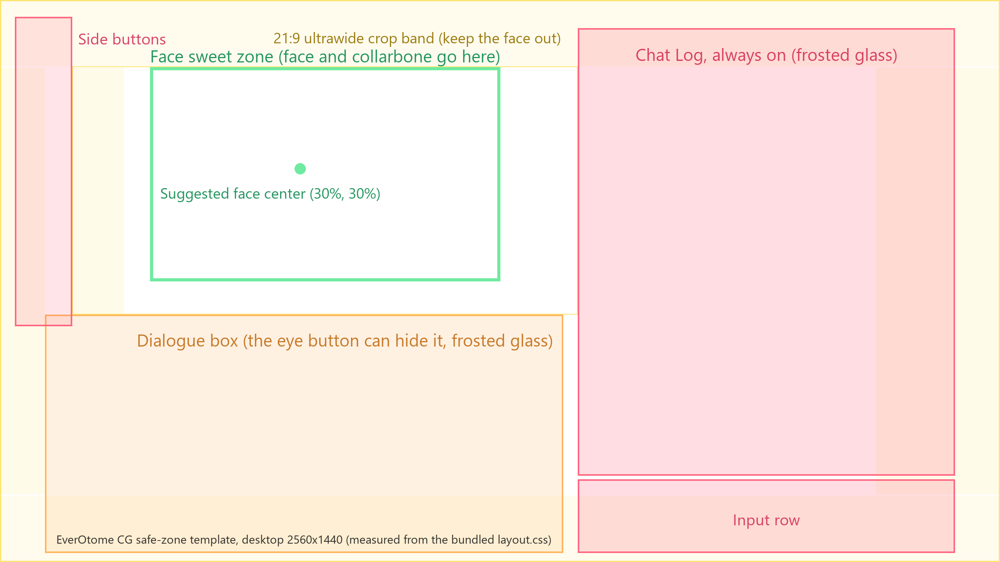
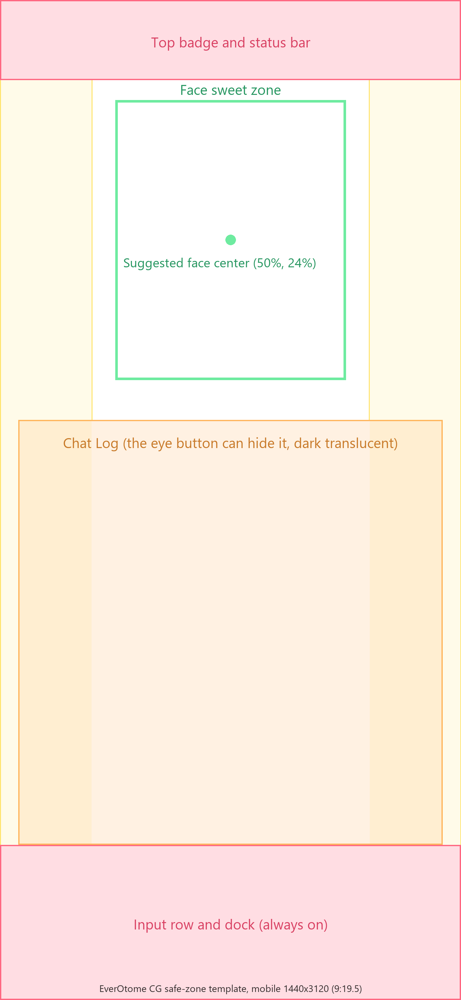

# CG album and composition guide

How the CG album is structured, and where to put faces so the interface never covers them. For the management protocol (upload, reorder, opening scenes), see the [backend contract](backend-contract.md#cgendpoint-album-base-url).

## The dual-track album format

`GET {cgEndpoint}/album` returns:

```json
{
  "items": [
    { "id": "1.png",  "name": { "zh-Hant": "月下絮語", "en": "Whispers Under the Moon" }, "target": "desktop", "opening": true },
    { "id": "m1.png", "name": { "zh-Hant": "月夜之約", "en": "Moonlit Promise" },         "target": "mobile",  "opening": true }
  ]
}
```

- **`target` splits the album into two tracks**: phones only see the `mobile` group, desktops only see the `desktop` group. Keep separate art per device so each screen gets a composition made for it. If a `cg_state` frame names a scene from the other device's group, the shell falls back to the current device's opening scene.
- **`opening: true` marks an opening candidate**: when a `cg_state` frame arrives with `scene: null`, the shell shows the group's first flagged item (falling back to the group's first item when none is flagged). Any number of items per group can carry the flag; the manage channel's `set_opening` toggles it per item, and the backend draws the actual opening scene from the candidates (see the [backend contract](backend-contract.md#cgendpoint-album-base-url)).
- **`id`** doubles as the file reference: the shell loads the image from `{cgEndpoint}/file/{id}`.
- **`name`** is shown to the user in the scene line when the CG comes on stage. It is a string, or one per language: `{ "zh-Hant": "…", "en": "…" }`; the shell shows the visitor's current interface language (the manage channel's `desc` works the same way).

## Composition safe zones

Part of your CG will sit under the UI. Compose with the face in the safe area:

| Desktop | Mobile |
|---|---|
|  |  |

- **Desktop** (2:1 or 16:9 canvas): the Chat Log begins at roughly the **58%** mark of the width and covers everything to its right. Keep the face in the left half; a good face center is around **(30%, 30%)**.
- **Mobile** (canvas ≈9:19.5, e.g. 852×1846): the Chat Log begins about **42%** of the way down and covers the area below it. A good face center is around **(50%, 24%)**.

These percentages are suggestions measured from the bundled layout. If you customize the CSS layout, remeasure before producing art in bulk. Both templates are transparent PNG overlays: drop one over your canvas in an image editor and keep the face inside the green box. The same templates with Chinese labels: [desktop](cg-safe-zone-desktop-zh.png), [mobile](cg-safe-zone-mobile-zh.png). All four are drawn by `tools/make_cg_safe_zone.py`; after a layout change, update the boxes in that script and run it again from the repository root with `python tools/make_cg_safe_zone.py` (it rewrites the four PNGs in `docs/`; `--help` lists the options; it needs Pillow, `python -m pip install pillow`).

## Rescue trick for existing art

If a finished piece has its face in the covered zone, you don't have to redraw it: shift the content away from the overlay, then blend the trailing edge into black with a gradient (desktop: shift left, fade the right edge; mobile: shift up, fade the bottom). The CG stage floats on a dark backdrop, so a gradient into black reads as intentional vignetting. The bundled demo album went through exactly this treatment and can serve as a reference.

Stuck? Tell us: [marshmallow-qa.com/a4u0myommjpyzup](https://marshmallow-qa.com/a4u0myommjpyzup)
